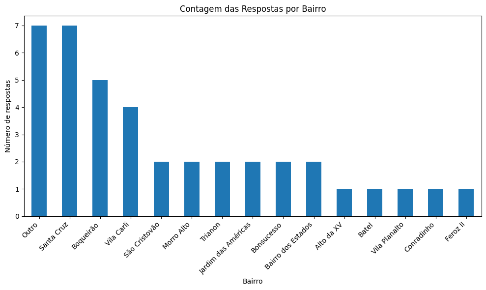
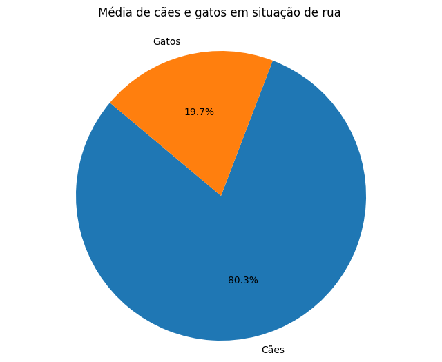
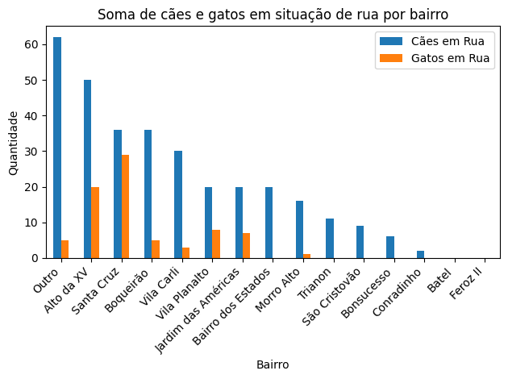
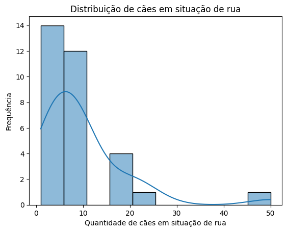
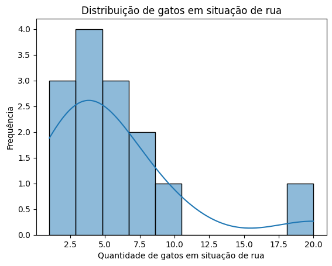

<h1>projetopatinhasnaweb</h1>

1 - Objetivo do projeto:
Analisar os dados coletados de um formulário do Google para identificar padrões, tendências ou insights interessantes sobre a situação de animais abandonados na cidade de Guarapuava.
 

2 - Coleta de dados do formulário do Google:
Criação de um formulário no Google Forms com as perguntas relevantes para o projeto, divulgado em redes sociais. 
Tempo estimado da primeira coleta de respostas: um mês (15/06/2023 - 21/07/2023)

Segunda coleta de respostas: 24/07/2023 - 01/12/2023

Formulário:  https://forms.gle/zL2vwQ79VLe1rB3J9                     
 

### Relatório Parcial - Estudo sobre Animais em Situação de Rua na Cidade
24/07/2023

### Introdução

Este relatório apresenta os resultados de um estudo sobre animais em situação de rua na cidade, com o objetivo de compreender a quantidade e distribuição de cães e gatos em diferentes bairros. Os dados foram coletados por meio de um formulário respondido pelos moradores, fornecendo informações valiosas para entender essa realidade.

#### Metodologia
A pesquisa foi realizada por meio de um formulário online, em que os participantes foram convidados a fornecer dados sobre a quantidade de cães e gatos em situação de rua em seus bairros. Foram obtidas 40 respostas, que serviram como base para as análises realizadas neste relatório.

## Resultados

- Média geral
A soma dos números de cães em situação de rua foi de 318, enquanto a soma dos números de gatos foi de 78, totalizando 396 animais nesta situação. Em relação à proporção, aproximadamente 80.3% são cães e 19.7% são gatos.

- Distribuição por bairro
Ao analisar os dados por bairro, a categoria genérica "Outro"* concentrou a maior quantidade de cães em situação de rua, seguida por "Alto da XV" e outros. Nota-se que "Feroz II" e "Batel" não tiveram registros de cães em situação de rua.

O bairro "Santa Cruz" se destacou por possuir a maior quantidade de gatos em situação de rua, seguido por "Alto da XV" e outros. Vários bairros tiveram a soma de gatos igual a zero, indicando a ausência de gatos em situação de rua nesses locais.

 - Análise Estatística dos Dados
   
*Cães em Situação de Rua*
Média: 9.94
Variância: 91.09
Desvio Padrão: 9.54
Mediana: 8.0
Moda: 10.0

Os cães em situação de rua apresentaram uma distribuição com cauda à direita, indicando que alguns bairros possuem quantidades significativamente maiores de cães abandonados. A média e a mediana estão próximas, mas a presença de valores extremos influenciou a média para a direita. A moda de 10 cães mostra que esse valor é o mais frequente entre os relatos.

*Gatos em Situação de Rua*
Média: 5.57
Variância: 23.49
Desvio Padrão: 4.85
Mediana: 4.5
Moda: 3.0

Os gatos em situação de rua apresentaram uma distribuição mais simétrica, mas também com cauda à direita. A média e a mediana estão próximas, indicando menos influência de valores extremos. A moda de 3.0 mostra que muitos bairros possuem aproximadamente 3 gatos abandonados.

- Intervalo de Confiança
Os intervalos de confiança de 95% para a média populacional de cães e gatos em situação de rua foram calculados. Para os cães, o intervalo ficou entre 6.7 e 13.2, enquanto para os gatos, variou entre 4.0 e 7.1. Isso significa que temos 95% de confiança de que a verdadeira média populacional de cães estará entre 6.7 e 13.2, e a de gatos estará entre 4.0 e 7.1.

### Considerações Finais
Embora tenhamos obtido estimativas iniciais sobre a quantidade de cães e gatos em situação de rua, é importante ressaltar que essas estimativas são baseadas em uma amostra relativamente pequena e podem ser aprimoradas com um aumento no tamanho da amostra e uma maior representatividade dos dados.

Neste sentido, continuaremos com a coleta de mais respostas para melhorar a precisão das estimativas e obter resultados mais confiáveis. As técnicas estatísticas empregadas nos proporcionam insights importantes, mas a busca por uma amostra mais abrangente é essencial para embasar políticas e ações efetivas no cuidado e proteção dos animais abandonados.

Agradecemos a participação de todos os moradores que contribuíram para esse estudo e reforçamos a importância da conscientização e engajamento da sociedade para enfrentar essa questão de forma responsável e humanitária.

*Nota: A categoria genérica "Outro" agrupa respostas que não puderam ser atribuídas a bairros específicos, mas que relataram animais de rua. A soma de cães e gatos para essa categoria é indicada para fornecer uma visão geral, mas é importante considerar que essas respostas não estão associadas a bairros específicos e são agrupadas em uma categoria geral.

# Autora:   
Michele Regina Bora
