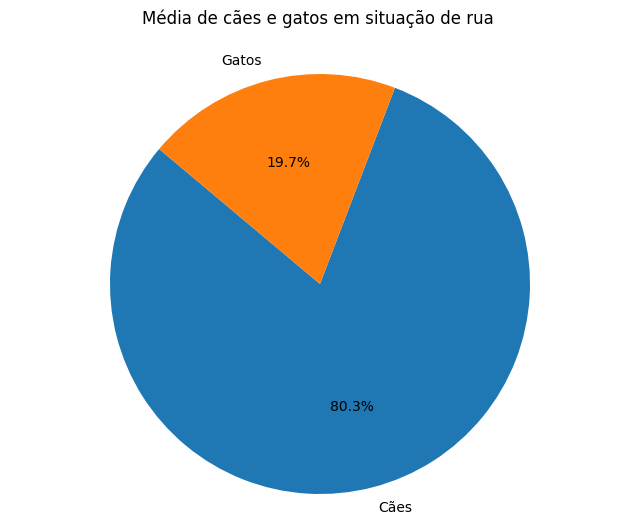
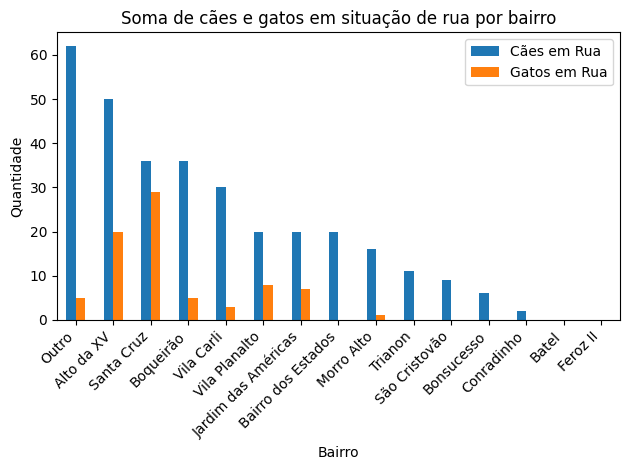
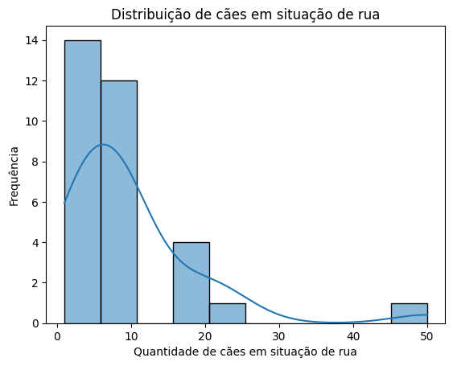

# Relatório parcial de análise dos animais em situação de rua em Guarapuava

Dia da última coleta das respostas do formulário para esta análise: 21/07/2023

 

### Apresentação das questões do formulário:
 'Bairro:',
 'CEP:',
 'Número de cães em situação de rua:',
 'Número de gatos em situação de rua:',
 'Em quais condições esses animais geralmente estão?',
 'Qual é o padrão de aparência mais comum dos cães de rua que você já observou? Por favor, selecione todas as opções que se aplicam.',
 'Você já viu ou soube de vizinhos que abandonaram animais?',
 'O que você acha da castração?',
 'Você costuma ajudar de alguma forma?',
 'Você pode deixar um comentário (opcional)'

 

### Quantidade total de respostas: 40

Por bairro:

Outro                  7
Santa Cruz             7
Boqueirão              5
Vila Carli             4
São Cristovão          2
Morro Alto             2
Trianon                2
Jardim das Américas    2
Bonsucesso             2
Bairro dos Estados     2
Alto da XV             1
Batel                  1
Vila Planalto          1
Conradinho             1
Feroz II               1

*Todos os bairros tiveram pelo menos uma resposta em qualquer pergunta.

 

### Média geral

Soma dos números de cães em situação de rua: 318
Soma dos números de gatos em situação de rua: 78

Cães: 318 / (318 + 78) = 0.803 = 80.3%
Gatos: 78 / (318 + 78) = 0.197 = 19.7%

 

### Distribuição por bairro 

Bairro: Boqueirão
Soma de cães: 36
Soma de gatos: 5
-------------------------
Bairro: Alto da XV
Soma de cães: 50
Soma de gatos: 20
-------------------------
Bairro: São Cristovão
Soma de cães: 9
Soma de gatos: 0
-------------------------
Bairro: Outro
Soma de cães: 62
Soma de gatos: 5
-------------------------
Bairro: Santa Cruz
Soma de cães: 36
Soma de gatos: 29
-------------------------
Bairro: Vila Carli
Soma de cães: 30
Soma de gatos: 3
-------------------------
Bairro: Morro Alto
Soma de cães: 16
Soma de gatos: 1
-------------------------
Bairro: Trianon
Soma de cães: 11
Soma de gatos: 0
-------------------------
Bairro: Batel
Soma de cães: 0
Soma de gatos: 0
-------------------------
Bairro: Jardim das Américas
Soma de cães: 20
Soma de gatos: 7
-------------------------
Bairro: Bonsucesso
Soma de cães: 6
Soma de gatos: 0
-------------------------
Bairro: Vila Planalto
Soma de cães: 20
Soma de gatos: 8
-------------------------
Bairro: Bairro dos Estados
Soma de cães: 20
Soma de gatos: 0
-------------------------
Bairro: Conradinho
Soma de cães: 2
Soma de gatos: 0
-------------------------
Bairro: Feroz II
Soma de cães: 0
Soma de gatos: 0
-------------------------
 

A categoria genérica "Outro"* acabou sendo a que possui a maior quantidade de cães em situação de rua (62 cães), seguido por "Alto da XV" (50 cães) e assim por diante. Os bairros "Feroz II" e "Batel" não teve registros de cães em situação de rua (soma igual a 0).

O bairro "Santa Cruz" possui a maior quantidade de gatos em situação de rua (29 gatos), seguido por "Alto da XV" (20 gatos) e assim por diante. Além disso, vários bairros têm a soma de gatos igual a 0, o que significa que não há gatos em situação de rua nesses bairros.

        *A presença do bairro *"Outro"* na análise indica que os participantes da pesquisa não especificaram corretamente o nome de seus bairros ou que não foram capazes de fornecer informações precisas sobre a localização. O bairro "Outro" pode ser usado como uma categoria genérica para agrupar todas as respostas que não puderam ser atribuídas a bairros específicos.
        No contexto dessa análise, a soma de cães em situação de rua para o bairro "Outro" é de 62 cães, o que significa que essa categoria agrupa respostas que relataram animais de rua, mas sem especificar seus bairros de origem. Da mesma forma, a soma de gatos em situação de rua para o bairro "Outro" é de 7 gatos.
        Essa categoria "Outro" pode ser útil para a análise, mas é importante reconhecer que pode conter uma variedade de respostas diferentes, e é por isso que a categoria é criada para agrupar essas situações. O importante é entender que essas respostas não estão associadas a bairros específicos e são agrupadas em uma categoria geral.

______________________________________________________________

______________
# Considerações e metodologia

A estimativa dos valores populacionais de cães e gatos em situação de rua foi realizada com base em uma amostra de 40 respostas coletadas por meio de um formulário online. É importante destacar que o tamanho dessa amostra é relativamente pequeno em relação ao tamanho da população estimada em 200.000 habitantes na cidade.
Considerando que uma amostra pequena pode resultar em estimativas menos precisas e mais suscetíveis a variações aleatórias, é necessário cautela na interpretação dos resultados. Reconhecendo essa limitação, buscamos obter estimativas mais precisas ao manter o formulário aberto, com o objetivo de aumentar o tamanho da amostra e torná-la mais representativa da população.
A análise dos dados foi iniciada com um processo de limpeza e transformação para garantir a qualidade dos dados utilizados. Em seguida, foram realizados cálculos estatísticos para obter as estimativas da média, variância e desvio padrão dos cães e gatos em situação de rua na cidade.

**Detalhamento na Documentação:**

Na documentação completa do estudo, detalhamos o passo-a-passo da análise, desde as ferramentas utilizadas até a aplicação de técnicas estatísticas para a obtenção das estimativas. Essa documentação abrangente oferece uma visão completa da metodologia adotada, permitindo que outros pesquisadores possam reproduzir e validar os resultados obtidos. Em suma, reconhecemos as limitações da amostra atual e ressaltamos a importância de continuar a coleta de respostas para melhorar a precisão das estimativas..
________________________________________________________________________

# Aprofundamento da análise dos dados numéricos

#### Observações sobre as estatísticas dos cães em situação de rua:

 - Média de cães em situação de rua: 9.9375
A média de cães em situação de rua é de aproximadamente 9.94. Isso indica que, em média, cerca de 10 cães são encontrados nas ruas com base nas respostas coletadas na pesquisa.

 - Variância de cães em situação de rua: 91.09274193548387
A variância dos cães em situação de rua é de aproximadamente 91.09. Esse valor representa a dispersão dos dados em relação à média. Quanto maior a variância, mais dispersos estão os valores das respostas em relação à média.

 - Desvio padrão de cães em situação de rua: 9.544251774522918
O desvio padrão dos cães em situação de rua é de aproximadamente 9.54. Esse valor é uma medida da dispersão dos dados em relação à média, sendo um pouco menor que a média. Um desvio padrão maior indica maior variabilidade nos dados.

 - Mediana de cães em situação de rua: 8.0
A mediana de cães em situação de rua é de 8. Essa estatística é o valor que divide a distribuição em duas partes iguais, ou seja, metade das respostas está abaixo de 8 e metade está acima.

 - Moda de cães em situação de rua: 10.0
A moda dos cães em situação de rua é de 10. Isso indica que o valor 10 é o mais frequente nas respostas coletadas, ocorrendo com maior frequência do que outros valores. Nesse caso, 10 cães é o número que mais aparece entre os relatos.

Resumo:
Média de cães em situação de rua: 9.9375
Variância de cães em situação de rua: 91.09274193548387
Desvio padrão de cães em situação de rua: 9.544251774522918
Mediana de cães em situação de rua: 8.0
Moda de cães em situação de rua: 10.0

#### A distribuição dos dados apresentou um histograma 'cauda à direita'

Se o histograma apresenta uma cauda à direita (ou assimétrica positiva), significa que a maior parte dos valores está concentrada no lado esquerdo do gráfico, e há alguns valores mais altos que estendem a cauda para o lado direito. Nesse caso, os valores maiores estão menos frequentes, o que resulta em uma assimetria positiva.
Essa observação pode indicar que há alguns casos extremos (outliers) com valores mais altos, mas a maioria dos dados está concentrada em valores menores. Isso pode acontecer em distribuições que apresentam valores discrepantes e pode afetar a média, puxando-a para a direita.

#### Observações sobre as estatísticas dos gatos em situação de rua:

 - A média de gatos em situação de rua é de aproximadamente 5.57, o que significa que, em média, são registrados cerca de 5.57 gatos de rua em cada bairro.

 - Variância de gatos em situação de rua: 23.49
A variância de gatos em situação de rua é de 23.49, indicando que os dados estão relativamente dispersos em relação à média.

 - Desvio padrão de gatos em situação de rua: 4.85
O desvio padrão de gatos em situação de rua é de aproximadamente 4.85, o que representa a dispersão dos valores em relação à média. 

 - Mediana de gatos em situação de rua: 4.5
A mediana de gatos em situação de rua é de 4.5, o que significa que metade dos bairros possui 4 ou menos gatos de rua e a outra metade possui 5 ou mais gatos de rua.

 - Moda de gatos em situação de rua: 3.0
A moda de gatos em situação de rua é de 3.0, indicando que o valor 3 é o mais frequente entre os dados. Isso significa que muitos bairros têm aproximadamente 3 gatos em situação de rua.

Resumo:
Média de gatos em situação de rua: 5.571428571428571
Variância de gatos em situação de rua: 23.4945054945055
Desvio padrão de gatos em situação de rua: 4.847113109316256
Mediana de gatos em situação de rua: 4.5
Moda de gatos em situação de rua: 3.0

 

 #### A distribuição dos dados apresentou um histograma 'cauda à direita'

Os dados sobre os gatos em situação de rua mostram uma distribuição aparentemente mais simétrica do que a dos cães, mas ainda com cauda à direita. A média (5.57) e a mediana (4.5) estão relativamente próximas, o que sugere uma distribuição menos influenciada por valores extremos. Além disso, a moda (3.0) indica que muitos bairros têm uma quantidade aproximada de 3 gatos em situação de rua, reforçando a distribuição simétrica. O desvio padrão (4.85) indica que há alguma variabilidade nos dados, mas não tão pronunciada quanto nos cães. Isso significa que a maioria dos bairros possui uma quantidade similar de gatos em situação de rua, com poucos bairros apresentando números significativamente maiores. No entanto, é importante observar o histograma dos dados para uma análise visual mais detalhada e para confirmar as características da distribuição. A distribuição com cauda à direita sugere que há alguns bairros com uma quantidade maior de gatos em situação de rua em comparação com a maioria dos bairros, o que pode indicar a presença de áreas de concentração de animais abandonados ou outras variáveis que influenciam essa distribuição. É sempre fundamental considerar o contexto e a natureza dos dados para interpretar adequadamente as características da distribuição.

#### Observações

O fato de o histograma dos cães em situação de rua e gatos em situação de rua apresentar cauda à direita sugere que os dados não estão distribuídos de maneira uniforme, e alguns bairros podem ter uma quantidade significativamente maior de animais em situação de rua do que a maioria dos outros bairros. Essa assimetria pode ser causada por fatores como a concentração de áreas de abandono, políticas de controle populacional de animais ou outros fatores que resultem em uma variação maior nos números observados. É sempre importante considerar o contexto e a natureza dos dados para interpretar adequadamente a distribuição.

_____________

*Intervalos de Confiança: Vamos supor um nível de confiança de 95%, que é comumente utilizado. O valor crítico para um nível de confiança de 95% é aproximadamente 1.96.

Desvio padrão amostral (s) = 
Tamanho da amostra (n) = (número total de respostas)
Média amostral (x̄) = (média dos cães em situação de rua com base nas respostas)

Limite inferior = x̄ - (valor crítico * (s / √n))
Limite superior = x̄ + (valor crítico * (s / √n))

*Para cães em situação de rua:*

Desvio padrão amostral (s) = 9.544251774522918
Tamanho da amostra (n) = 40 (número total de respostas)
Média amostral (x̄) = 9.9375 (média dos cães em situação de rua com base nas respostas)

Limite inferior = 9.9375 - (1.96 * (9.544251774522918 / √40)) ≈ 7.5307
Limite superior = 9.9375 + (1.96 * (9.544251774522918 / √40)) ≈ 12.3443

O intervalo de confiança para a média de cães em situação de rua é aproximadamente 7.53 a 12.34.

*Para gatos em situação de rua:*

Desvio padrão amostral (s) = 4.85
Tamanho da amostra (n) = 40 (número total de respostas)
Média amostral (x̄) = 5.571428571428571 (média dos gatos em situação de rua com base nas respostas)

Limite inferior = 5.571428571428571 - (1.96 * (4.85 / √40)) ≈ 3.9424
Limite superior = 5.571428571428571 + (1.96 * (4.85 / √40)) ≈ 7.2004

O intervalo de confiança para a média de gatos em situação de rua é aproximadamente 3.94 a 7.20.

 

#### Observações

Esses intervalos de confiança representam a faixa de valores prováveis para a verdadeira média populacional de cães e gatos em situação de rua em toda a cidade, com 95% de confiança. Isso significa que temos 95% de confiança de que a média populacional está contida dentro desses intervalos. Porém, é importante ressaltar que esses intervalos são baseados em uma amostra de 40 respostas e que a precisão das estimativas pode ser maior com amostras maiores e mais representativas da população. Apesar das técnicas estatísticas ajudarem a melhorar a qualidade das estimativas, o tamanho da amostra e a representatividade dos dados ainda são fatores críticos para obter resultados mais confiáveis. Portanto,buscaremos aumentar o tamanho da amostra e refazer os cálculos.
_____________________________________________________________________

*Próximos passos:* 

* Testes de Hipóteses: Use testes estatísticos para verificar a significância estatística das estimativas. Isso permite determinar se as diferenças observadas entre grupos ou variáveis são estatisticamente significativas ou apenas resultado do acaso.

* Regressão: Se tiver várias variáveis explicativas para prever ou explicar uma variável de interesse, a análise de regressão pode ajudar a entender as relações entre as variáveis.

* Análise de Sensibilidade: Avaliar a sensibilidade das estimativas a diferentes suposições e parâmetros para entender melhor as implicações dos resultados.

___________________________________________________________________

# Análise dos dados categóricos (em andamento)

Para análise de dados categóricos, estatísticas e gráficas que podem ser utilizadas. Algumas delas são:

Tabelas de Frequência: Para contar a ocorrência de cada categoria em uma variável categórica. Isso é útil para ter uma visão geral da distribuição dos dados.

Gráficos de Barras: Representa visualmente as frequências de cada categoria usando gráficos de barras. Isso torna a análise mais intuitiva e ajuda a comparar diferentes categorias.

Gráficos de Pizza: Para visualizar a proporção de cada categoria em relação ao total. É uma forma de apresentar a distribuição relativa dos dados.

Testes de Qui-quadrado: Os testes de qui-quadrado são usados para determinar se existe uma associação significativa entre duas ou mais variáveis categóricas.

Análise de Clusterização: Técnicas de clusterização para agrupar categorias similares em grupos. Isso pode ajudar a identificar padrões ou segmentos nos dados categóricos.

Análise de Correspondência: A análise de correspondência é uma técnica multivariada que permite visualizar associações entre categorias de duas ou mais variáveis categóricas em um gráfico bidimensional.

Análise de Regressão Logística: A regressão logística é usada para modelar e prever a probabilidade de uma categoria específica em relação a outras variáveis explicativas.

Essas são algumas das técnicas mais comuns que usaremos para a análise de dados categóricos.